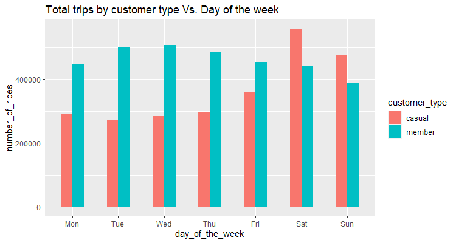

# Google-Data-Analytics-Capstone-Project-1

## INTRODUCTION

### Created to showcase my take on Google Capstone Case Study for Cyclistic Bike Share

### How does a bike-share navigate speedy success?

This capstone case study on Cyclistic bike share is part of Google Data Analytics Professional course by Google on Coursera

### The data exploration, cleaning and analysis are done using:

1. R Studio
2. Tableau

### Case Study Objective

Cyclistic, a bike share company in Chicago wants to understand how casual riders and annual members use Cyclistic bikes differently. These insights will be used to design a new marketing strategy to convert casual riders into annual member as the company believes that the company’s future success depends on maximizing the number of annual memberships

### Brief background and summary of case study company

* Cyclistic is a bike-sharing company, their portfolio features multiple programs and projects. 
* Cyclistic owns a fleet of more than 5,824 bicycles and maintains 692 docking stations. 
* Cyclistic also has a unique value proposition, where they offer reclining bikes, hand tricycles, and cargo bikes. This is part of a wider program that aims to make bike-share more inclusive to people with disabilities and riders who can’t use a standard two-wheeled bike. 
* The majority of users opt for traditional bikes, and about 8% of users opted for the assistive options. 
* Cyclistic users are more likely to ride for leisure, but about 30% use them to commute to work each day.
* Cyclistic operates mainly in the state of Illinois, Chicago City.

The director of marketing, Lily Moreno, believes that maximizing the number of annual members will be key to future growth. Rather than creating a marketing campaign that targets all-new customers, Moreno believes there is a very good chance to convert casual riders into members.

### Questions to explore relating to business task:

> #### Main: 
> How do annual members and casual riders use Cyclistic bikes differently?

>> #### Sub: 
>> 1. What are the biggest differences in behaviours between casual riders and annual members?
>> 2. Are the differences in behaviours the reasons why casual riders stay casual, and annual members are willing to maintain their subscription?
>> 3. What causes the differences in behaviours?

### Deliverables:
* Insights on users behaviours.
* Data Visualisation for easy understanding and punchline.
* RMD file for tracking and replication purposes.

### Data Sources
Historical bike trip data provided by Motivate International Inc. under licence from Divvy Bikes. (The datasets have a different name because Cyclistic is a fictional company for the purpose of the Google Data Analytic Capstone project). Personal identifiable information are not available due to data-privacy.

> Dataset was downloaded from https://divvy-tripdata.s3.amazonaws.com/index.html. For the purpose of this analysis, 12 months of data from May 2021 to April 2022 will be prepared and analysed. The most recent data available is April 2022. Total data size is approximately 1.61GB.

### Dataset was checked for credibility

* The dataset is assumed to be reliable (data is based on a fictitious entity), original, cited as it is provided under licence as above.
* Data is current as the most recent data used is April 2022
* There are missing data points for start station and end station and geographic latitude and longitude in the dataset therefore the data is not as comprehensive as it could have been. We will keep this in mind and account for these during data analysis.

### Documentation, Cleaning and Preparation of data for analysis
The combined size of all the 12 datasets is close to 1.61 GB. Data cleaning in spreadsheets will be time-consuming and slow compared to SQL or R. Chosed R simply because I could do both data wrangling and analysis/ visualizations in the same platform. It is also an opportunity for me to learn R better.

### Limitation/Assumptions made of data available

* No information on where users lives in the Cyclistic area of operations, this is due to data-privacy issues prohibit the use of users’ personally identifiable information.
* Analysis and insights will be limited on the casual rider’s behaviour as there are no data on types of purchase (single pass or full-day pass) and if there are multiple purchases from the same casual rider.

## DATA PREPARATION

### Packages used

> install.packages("tidyverse")
>  install.packages("lubridate")
>  install.packages("janitor")
>  install.packages("data.table")

### Libraries loaded

> library(tidyverse)
>  library(lubridate)
>  library(janitor)
>  library(data.table)

### Loading datasets

> tripdata_202105 <- read.csv("202105-divvy-tripdata.csv")
>  tripdata_202106 <- read.csv("202106-divvy-tripdata.csv")
>  tripdata_202107 <- read.csv("202107-divvy-tripdata.csv")
>  tripdata_202108 <- read.csv("202108-divvy-tripdata.csv")
>  tripdata_202109 <- read.csv("202109-divvy-tripdata.csv")
>  tripdata_202110 <- read.csv("202110-divvy-tripdata.csv")
>  tripdata_202111 <- read.csv("202111-divvy-tripdata.csv")
>  tripdata_202112 <- read.csv("202112-divvy-tripdata.csv")
>  tripdata_202201 <- read.csv("202201-divvy-tripdata.csv")
>  tripdata_202202 <- read.csv("202202-divvy-tripdata.csv")
>  tripdata_202203 <- read.csv("202203-divvy-tripdata.csv")
>  tripdata_202204 <- read.csv("202204-divvy-tripdata.csv")

### colnames() for column names consistency

> colnames(tripdata_202204)
>  colnames(tripdata_202203)
>  colnames(tripdata_202202)
>  colnames(tripdata_202201)
>  colnames(tripdata_202112)
>  colnames(tripdata_202111)
>  colnames(tripdata_202110)
>  colnames(tripdata_202109)
>  colnames(tripdata_202108)
>  colnames(tripdata_202107)
>  colnames(tripdata_202106)
>  colnames(tripdata_202105)

### str() for data structure and data types consistency

> str(tripdata_202204)
>  str(tripdata_202203)
>  str(tripdata_202202)
>  str(tripdata_202201)
>  str(tripdata_202112)
>  str(tripdata_202111)
>  str(tripdata_202110)
>  str(tripdata_202109)
>  str(tripdata_202107)
>  str(tripdata_202106)
>  str(tripdata_202105)

#### *Note - data type for started_at and ended_at were in chr, and needs to be changed to dttm. dateTime format of these 2 column are not consistent throughout the checks as well, I have decided to align all data to y-m-d HMS format.*

### Cleanup Required - Changing dateTime format for tripdata_202105, tripdata_202203 and tripdata_202204

> tripdata_202105_processed <- tripdata_202105_processed %>% mutate(across(c(started_at, ended_at), dmy_hms))
>   tripdata_202203_processed <- tripdata_202203_processed %>% mutate(across(c(started_at, ended_at), dmy_hms))
>   tripdata_202204_processed <- tripdata_202204_processed %>% mutate(across(c(started_at, ended_at), dmy_hms))

### Cleanup Required - Changing datatype from chr to dttm for the rest of the datasets

> tripdata_202106_processed <- tripdata_202106 %>% mutate(across(c(started_at, ended_at), ~ as.POSIXct(.x, format = "%Y-%m-%d %H:%M:%S") %>% ymd_hms())) 
>   tripdata_202107_processed <- tripdata_202107 %>% mutate(across(c(started_at, ended_at), ~ as.POSIXct(.x, format = "%Y-%m-%d %H:%M:%S") %>% ymd_hms()))
>   tripdata_202108_processed <- tripdata_202108 %>% mutate(across(c(started_at, ended_at), ~ as.POSIXct(.x, format = "%Y-%m-%d %H:%M:%S") %>% ymd_hms()))
>   tripdata_202109_processed <- tripdata_202109 %>% mutate(across(c(started_at, ended_at), ~ as.POSIXct(.x, format = "%Y-%m-%d %H:%M:%S") %>% ymd_hms()))
>   tripdata_202110_processed <- tripdata_202110 %>% mutate(across(c(started_at, ended_at), ~ as.POSIXct(.x, format = "%Y-%m-%d %H:%M:%S") %>% ymd_hms()))
>   tripdata_202111_processed <- tripdata_202111 %>% mutate(across(c(started_at, ended_at), ~ as.POSIXct(.x, format = "%Y-%m-%d %H:%M:%S") %>% ymd_hms()))
>   tripdata_202112_processed <- tripdata_202112 %>% mutate(across(c(started_at, ended_at), ~ as.POSIXct(.x, format = "%Y-%m-%d %H:%M:%S") %>% ymd_hms()))
>   tripdata_202201_processed <- tripdata_202201 %>% mutate(across(c(started_at, ended_at), ~ as.POSIXct(.x, format = "%Y-%m-%d %H:%M:%S") %>% ymd_hms()))
>   tripdata_202202_processed <- tripdata_202202 %>% mutate(across(c(started_at, ended_at), ~ as.POSIXct(.x, format = "%Y-%m-%d %H:%M:%S") %>% ymd_hms()))

### Combine datasets into one dataframe

> all_trips <-  bind_rows(tripdata_202204_processed,tripdata_202203_processed,tripdata_202202_processed,tripdata_202201_processed,tripdata_202112_processed,tripdata_202111_processed,tripdata_202110_processed,tripdata_202109_processed,tripdata_202108_processed,tripdata_202107_processed,tripdata_202106_processed,tripdata_202105_processed)

## DATA PROCESSING

### Quick glimpse to identify if renaming are required

> $ ride_id            <chr> "A847FADBBC638E45", "5405B80E996FF60D", "5DD24A79A4…
>  $ rideable_type      <chr> "docked_bike", "docked_bike", "docked_bike", "docke…
>  $ started_at         <dttm> 2020-04-26 17:45:14, 2020-04-17 17:08:54, 2020-04-…
>  $ ended_at           <dttm> 2020-04-26 18:12:03, 2020-04-17 17:17:03, 2020-04-…
>  $ start_station_name <chr> "Eckhart Park", "Drake Ave & Fullerton Ave", "McClu…
>  $ start_station_id   <chr> "86", "503", "142", "216", "125", "173", "35", "434…
>  $ end_station_name   <chr> "Lincoln Ave & Diversey Pkwy", "Kosciuszko Park", "…
>  $ end_station_id     <chr> "152", "499", "255", "657", "323", "35", "635", "38…
>  $ start_lat          <dbl> 42.01913, 41.85308, 41.87184, 41.85308, 41.87181, 41.884~
>  $ start_lng          <dbl> -87.67353, -87.63193, -87.64664, -87.63193, -87.64657, -~
>  $ end_lat            <dbl> 42.05294, 41.88189, 41.88189, 41.86749, 41.88224, 41.879~
>  $ end_lng            <dbl> -87.67345, -87.64879, -87.64879, -87.63219, -87.64107, -~
>  $ member_casual      <chr> "member", "member", "member", "member", "casual", "…
  
### Rename columns for better readability
 
> all_trips <- all_trips %>% 
  rename(ride_type = rideable_type,start_time = started_at,end_time = ended_at,customer_type = member_casual)
  
### Add new columns that will be used for agregation.

> *Day of the week the trip started*
>   all_trips$day_of_the_week <- format(as.Date(all_trips$start_time),'%a')
>  
>   *Month when the trip started*
>   all_trips$month <- format(as.Date(all_trips$start_time),'%b_%y')
>  
>   *Trip duration in min*
>   all_trips$trip_duration <- (as.double(difftime(all_trips$end_time, all_trips$start_time)))/60
>> *Time of the day when the trip started*
>>   *Note - two-step conversion is needed to get hours-minutes-seconds in POSIXct for ggplot2*
>>   all_trips$time <- format(all_trips$start_time, format = "%H:%M")
>>   all_trips$time <- as.POSIXct(all_trips$time, format = "%H:%M")

### Check if any trip duration is in the negative.

> nrow(subset(all_trips,trip_duration < 0))
>   [1] 139

### Check if any testrides were made

> nrow(subset(all_trips, start_station_name %like% "TEST"))
>  [1] 0
>   nrow(subset(all_trips, start_station_name %like% "test"))
>  [1] 0
>   nrow(subset(all_trips, start_station_name %like% "Test"))
>  [1] 1

### Remove irrelavant data

> *negative trip durations*
>   all_trips_v2 <- all_trips[!(all_trips$trip_duration < 0),]
>  
>   *remove test rides*
>   all_trips_v2<- all_trips_v2[!((all_trips_v2$start_station_name %like% "Test" | all_trips_v2$start_station_name %like% "test")),]

### Check if there is only two customer types

> table(all_trips_v2$customer_type)
>> casual  member 
>>   2536297 3221114  

## ANALYSE AND GAIN INSIGHTS

### summary of trip_duration for all trips
summary(all_trips_v2$trip_duration)
| Min. | 1st Qu. | Median | Mean | 3rd Qu. | Max. | 
|---|---|---|---|---|---|
| 0.0 | 6.43 | 11.52 | 21.14 | 21.00 | 55944.15 |

### summary of trip_duration by customer_type
all_trips_v2 %>%
  group_by(customer_type) %>%
  summarise(min_trip_duration = min(trip_duration),max_trip_duration = max(trip_duration),
  median_trip_duration = median(trip_duration), mean_trip_duration = mean(trip_duration))

A tibble: 2 x 5

  | customer_typ | min_trip_duration | max_trip_duration | median_trip_dur~ | mean_trip_durat~ |
|--------------|-------------------|-------------------|------------------|------------------|
| <chr>        | <dbl>             | <dbl>             | <dbl>            | <dbl>            |
| 1 casual     | 0                 | 55944.            | 15.6             | 31.3             |
| 2 member     | 0                 | 1560.             | 9.1              | 13.1             |

*Note - member mean trip duration (13.1) is lower than all trip mean trip duration (21.14), whereas casual riders mean trip duration (31.3) is higher than the the mean trip duration of all trips. This tells us that casual riders statistically take the bikes out for a longer duration compared to members over sample size.

### Total number of trips by customer type and day of the week

*Order time and month column for easier reference*
> all_trips_v2$day_of_the_week <- ordered(all_trips_v2$day_of_the_week, levels=c("Mon", "Tue", "Wed", "Thu", "Fri", "Sat", "Sun"))
>  
>  all_trips_v2$month <- ordered(all_trips_v2$month, levels=c("May_21", "Jun_21", "Jul_21", "Aug_21", "Sep_21", "Oct_21", "Nov_21", "Dec_21", "Jan_22", "Feb_22", "Mar_22", "Apr_22"))

*Summarise into table*

> 
 all_trips_v2 %>% 
>   group_by(customer_type, day_of_the_week) %>%  
>   summarise(number_of_rides = n(),average_duration_mins = mean(trip_duration)) %>% 
>   arrange(customer_type, desc(number_of_rides))

*A tibble: 14 x 4*
*Groups:   customer_type [2]*
|   customer_type |day_of_the_week |number_of_rides |average_duration_mins|
|-----------------|-----------------|---------------|---------------------|
|   <chr>         |<ord>            |         <int> |                <dbl>|
| 1 casual        |Sat              |        558610 |                 34.2|
| 2 casual        |Sun              |        476993 |                 37.0|
| 3 casual        |Fri              |        358197 |                 29.2|
| 4 casual        |Thu              |        298061 |                 27.9|
| 5 casual        |Mon              |        289026 |                 31.1|
| 6 casual        |Wed              |        284866 |                 27.1|
| 7 casual        |Tue              |        270544 |                 26.5|
| 8 member        |Wed              |        506935 |                 12.4|
| 9 member        |Tue              |        498679 |                 12.3|
|10 member        |Thu              |        485840 |                 12.4|
|11 member        |Fri              |        453278 |                 12.9|
|12 member        |Mon              |        445628 |                 12.7|
|13 member        |Sat              |        442737 |                 14.8|
|14 member        |Sun              |        388017 |                 15.1|

*Visualisation*

>
 all_trips_v2 %>%  
>      group_by(customer_type, day_of_the_week) %>% 
>      summarise(number_of_rides = n()) %>% 
>      arrange(customer_type, day_of_the_week)  %>% 
>      ggplot(aes(x = day_of_the_week, y = number_of_rides, fill = customer_type)) +
>      labs(title ="Total trips by customer type Vs. Day of the week") +
>      geom_col(width=0.5, position = position_dodge(width=0.5)) +
>      scale_y_continuous(labels = function(x) format(x, scientific = FALSE))

# Total trips by customer type Vs. Day of the week

